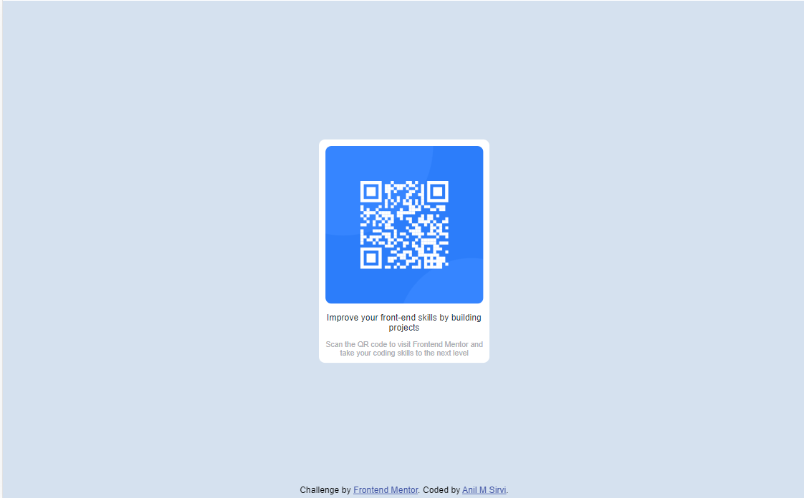

# Frontend Mentor - QR code component solution

This is a solution to the [QR code component challenge on Frontend Mentor](https://www.frontendmentor.io/challenges/qr-code-component-iux_sIO_H). Frontend Mentor challenges help you improve your coding skills by building realistic projects. 

## Table of contents

- [Overview](#overview)
  - [Screenshot](#screenshot)
  - [Links](#links)
- [My process](#my-process)
  - [Built with](#built-with)
  - [What I learned](#what-i-learned)
  - [Continued development](#continued-development)
  - [Useful resources](#useful-resources)
- [Author](#author)

## Overview

### Screenshot




### Links

- Solution URL: [](https://github.com/Anil2710/QR-code-component-challenge)
- Live Site URL: [](https://your-live-site-url.com)

## My process

### Built with

- Semantic HTML5 markup
- CSS custom properties
- Flexbox

### What I learned

```css
.cardContainer {
      border-radius: 10px;
      padding: 10px;
      text-align: center;
      position: absolute;
      top: 50%;
      left: 50%;
      transform: translate(-50%, -50%);
      background-color: white;
      max-width: 17rem;
}
```

### Continued development

I would like to make my unique QR code generator.

### Useful resources

- [W3Schools](https://www.w3schools.com) - This helped me to understand better how to use flexbox.

## Author

- Frontend Mentor - [@Anil2710](https://www.frontendmentor.io/profile/Anil2710)

